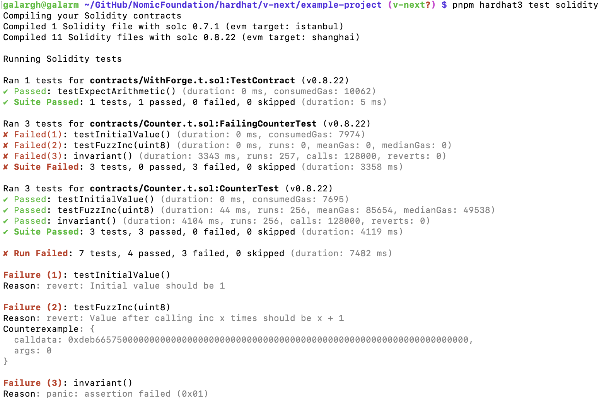

# Solidity Testing in Hardhat

Solidity Testing is a new feature that's coming with Hardhat v3.

## Demo

### Instructions

```sh
cd ~/GitHub/NomicFoundation/hardhat/v-next/example-project/
pnpm hardhat3 test solidity
```

### Output




## What's happening here?

- [A test contract](./example-project/contracts/Counter.t.sol)
- [The tested contract](./example-project/contracts/Counter.sol)

### TLDR

1. Compilation*
1. Test Running*/Output Formatting
1. Done

\*source/test discovery

### Details

1. An [solidity test subtask](./hardhat/src/internal/builtin-plugins/solidity-test/index.ts) starts
1. We [call the solidity compile task](./hardhat/src/internal/builtin-plugins/solidity-test/task-action.ts#L23) to compile all the solidity sources (tests, sources and potentially some dependencies)
    - 💁 We are not using the Build System programatically here yet, but doing so would allow us to be more precise with what we compile.
1. We [find all the compiled solidity artifacts](./hardhat/src/internal/builtin-plugins/solidity-test/task-action.ts#L27) that we want to pass to the test runner
    - 💁 We, currently, always run all the tests we can find and use all the artifacts we can find as the context
1. We [run all the solidity tests](./hardhat/src/internal/builtin-plugins/solidity-test/task-action.ts#L54) that we found
    - 💁 We use EDR as a library here to run the tests. This pattern could easily be replicated by other tools.
    - 💁 We [turn the results we receive back from EDR into an asynchronous event stream](./hardhat/src/internal/builtin-plugins/solidity-test/runner.ts) to nicely decouple test running from output formatting.
1. We [format the results we receive back from EDR](./hardhat/src/internal/builtin-plugins/solidity-test/reporter.ts)
    - 💁 We, currently, receive all the test results for a single suite as one event.
    - 💁 We format the results similarly to how Forge formats solidity tests results.
    - 💁 We display error details at the very end of the test run for easier discoverability (similarly to how we do it in our very own [Node Test Reporter](./hardhat-node-test-reporter/README.md)).
    - 💁 The way the output is formatted is subject to change (feedback more than welcome 🙏).
1. We [wait for the test runner to finish](./hardhat/src/internal/builtin-plugins/solidity-test/task-action.ts#L70)
    - 💁 As we found out, there are quite a few gotchas when trying to wait for an async strem piped to stdout to finish.
1. We [exit with an appropriate exit code](./hardhat/src/internal/builtin-plugins/solidity-test/task-action.ts#L84)

## Can we migrate from Forge to Hardhat?

Yes, we can!

https://github.com/galargh/solidity-testing-testing

## Why are there so many failures?

We don't support test runner configuration yet. This is follow up scheduled for after the alpha.

## What's next?

### After the "⍺"

- full configuration support
- selective test running
- lazy compilation
- output formatting improvements
- ...

### NOW ‼️

- **excellent presentation from Agost on how all of the above is possible** 😻😻😻
